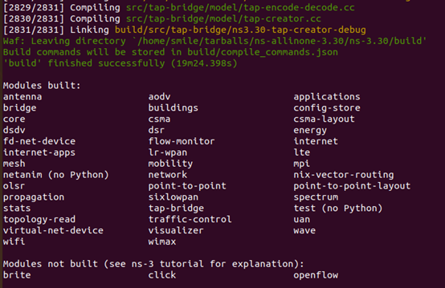
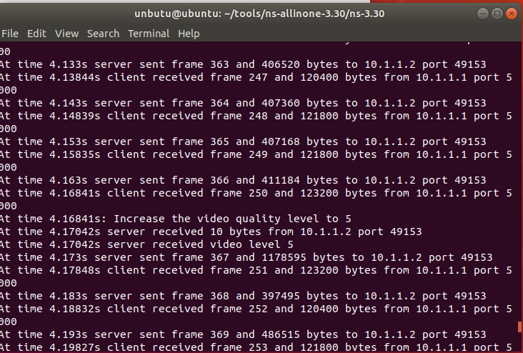
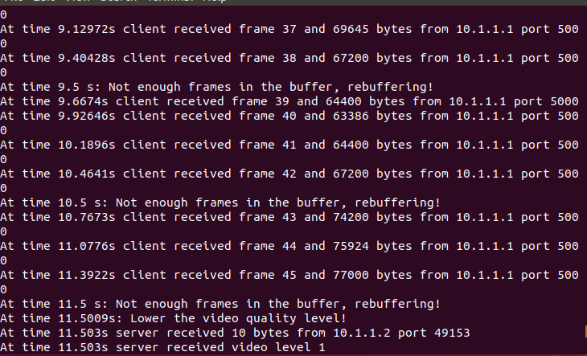

###此记录是ubuntu18.04安装ns-3的过程
####安装依赖，[点这里](https://www.nsnam.org/docs/release/3.30/tutorial/singlehtml/index.html#getting-started)按照官网安装ns-3的依赖  
####下载ns-3.30安装包  
`wget http://www.nsnam.org/release/ns-allinone-3.30.tar.bz2`  
####解压安装包
`tar xjf ns-allinone-3.30.tar.bz2`  
#### ns-allinone-3.30 文件下ns-3编译
`sudo ./build.py --enable-examples --enable-tests`  
  
###测试videostream  
`git clone https://github.com/guoxiliu/VideoStream-NS3.git`
####将VideoStream-NS3目录中的scratch,src的文件拷贝到ns-allinone-3.30中的ns-3.30目录中的对应目录中
####重新编译ns-3
在ns-3.30目录下执行
`sudo ./waf clean`  
`sudo ./waf`  
最后结果养龟与上附图一致  
####代码测试  
在ns-3.30目录执行
`sudo ./waf --run videoStreamer`
得到如下结果  
 
在设置videoStreamTest.cc中带宽为2mb之后再重新编译并执行
`sudo ./waf --run videoStreamer`后可以看到
 